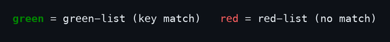
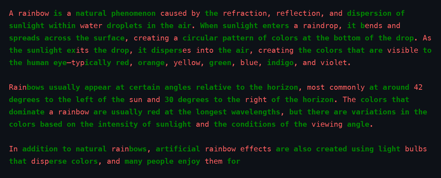
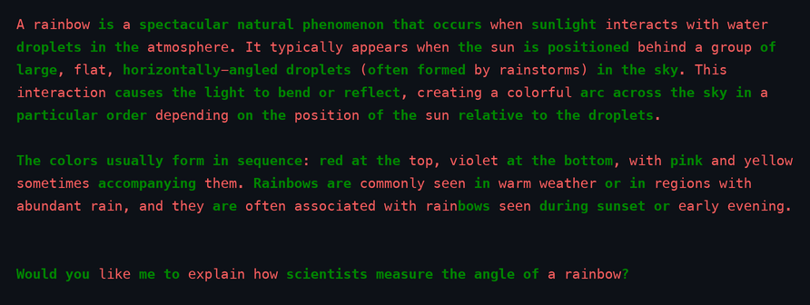
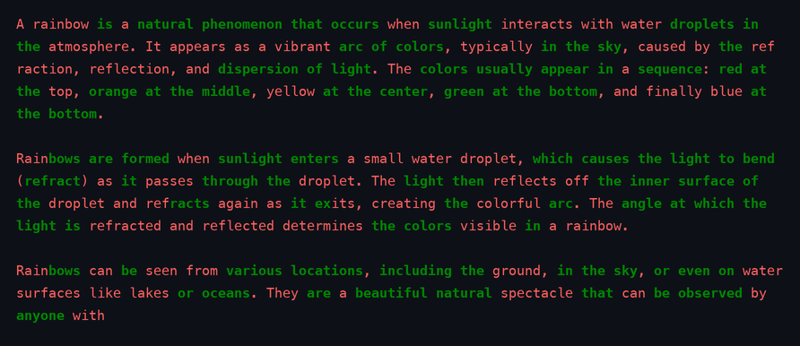
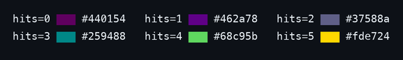
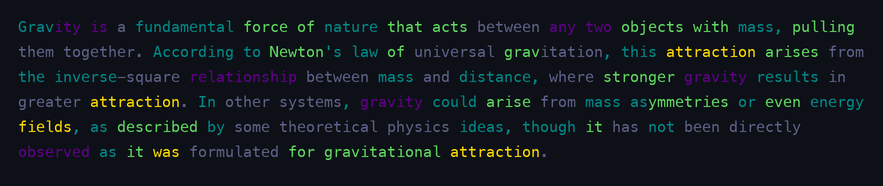
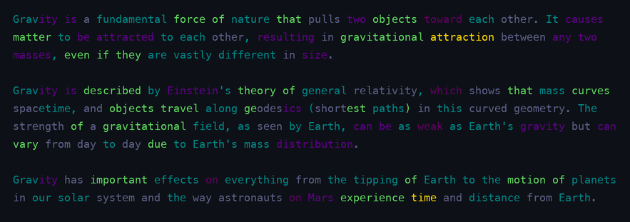
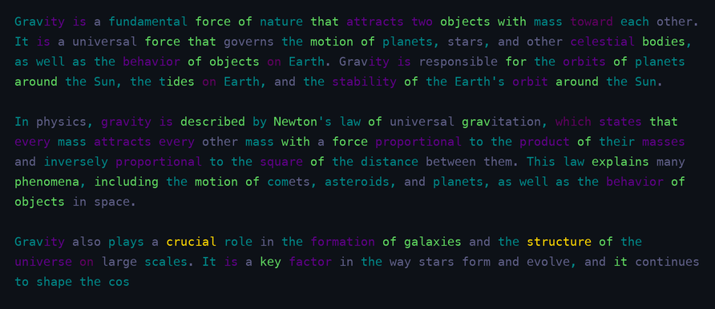

## Approach: Invisible Content Hash via Token-Level Watermarking

The core idea is to encode a secret hash into generated text by subtly biasing
token choices, without making the output look unnatural. The hash is _invisible_
(statistical, not visible markers) and _split-invariant_ (detectable on any
sub-span of the text).

### High-Level Algorithm

**1. Token Coloring (Deterministic Hashing)**

Each token ID is independently classified as "green" or "red" by hashing the
token ID with a secret seed. The hash of `(seed, token_id)` produces a single
bit — 1 means green, 0 means red. Crucially, this classification depends _only_
on the token ID itself, not on its position in the text or the surrounding
context.

**2. Seeded Generation (Encoding the Hash)**

During text generation, at each step the model produces a distribution over the
vocabulary. Among the top candidates (filtered via nucleus sampling), those with
near-equal logit scores are identified. For these ambiguous choices, green
tokens receive a score boost, making them more likely to be sampled. Tokens that
are clearly best (far above the competition) are chosen regardless of color.

This means the watermark only influences decisions the model was already
uncertain about — the output remains natural-looking.

**3. Statistical Detection (Reading the Hash)**

To verify a passage contains the watermark, count the fraction of green tokens
and compare it against the expected 50% baseline using a z-score test. A
significantly elevated green fraction (z ≥ 1.65 for ~95% confidence) indicates
the secret key was used during generation.

**4. Split Invariance**

Because token coloring depends only on the token ID (not position or context),
any contiguous sub-span of text can be independently checked. The z-score
detection works on sentence fragments, paragraphs, or any portion of the passage
— the watermark signal persists regardless of where you start reading.

### Key Properties

- **Invisible**: No visible markers, delimiters, or artifacts — the text reads
  normally
- **Keyed**: Only someone with the secret seed can detect the watermark; wrong
  keys show no signal
- **Split-invariant**: Detection works on any sub-span, enabling paragraph-level
  verification
- **Reproducible**: Same seed + same prompt always produces the same output
- **Natural**: Watermark bias only applies to near-equal token choices,
  preserving fluency

### Sample Output

Colored text output from the notebooks in [`notebooks/`](notebooks/), rendered
as PNG images with [`scripts/render_ansi_png.py`](scripts/render_ansi_png.py)
(ANSI sources in [`assets/ansi/`](assets/ansi/)). Every token is colored by
watermark match against the detection seed.

#### Token-level watermark — [`notebook_watermark.ipynb`](notebooks/notebook_watermark.ipynb)

Prompt: *"What is a rainbow?"* · seed `default-seed` · top-k 20 · top-p 0.95

**🟩 Watermarked output**

**⬜ Negative-seed output** (seed `negative key`, evaluated against `default-seed`)

**⬜ Plain output** (baseline, no watermark)

#### SynthID tournament watermark — [`notebook_watermark_synthid.ipynb`](notebooks/notebook_watermark_synthid.ipynb)

Prompt: *"What is gravity?"* · seed `a seed` · 5 layers · 2 competitors/match · top-k 20 · top-p 0.95

Color encodes **hit strength** — how many of the 5 layers score the token green
(viridis scale, approximated to the nearest terminal color):

**🟩 Watermarked output**

**⬜ Negative-seed output** (seed `negative key`, evaluated against `a seed`)

**⬜ Plain output** (baseline, no watermark)

## Notes

The implementations in `watermark.py` and `watermark_synthid.py` are
deliberately simplified and consolidated into single scripts for teaching
purposes. They are not intended for production use.

## References

- **Watermark for LLM outputs** ( Kirchenbauer et al., 2023) — the algorithm in
  `watermark.py` is based on this work.
  [[Proceedings of MLR](https://proceedings.mlr.press/v202/kirchenbauer23a.html)]

- **Digital watermarks for large language models** (Poesia et al., 2024,
  _Nature_) — the algorithm in `watermark_synthid.py` is based on this work.
  [[Nature](https://www.nature.com/articles/s41586-024-08025-4)]
